  

# Fallout

> Build automation for C#/.NET — the hard-fork successor to NUKE.

> [!IMPORTANT]
> **Rebrand in progress.** This repository is in the middle of being renamed from **NUKE** to **Fallout** as part of a hard fork. URLs, package names, and namespaces are migrating in stages — see the [Fallout rebrand milestone](https://github.com/ChrisonSimtian/nuke/milestone/1) for status. The legacy `Nuke.*` namespaces are still in use; the `Fallout.*` rename is tracked in issue [#32](https://github.com/ChrisonSimtian/nuke/issues/32).
>
> Packages currently publish to **GitHub Packages** under this fork's feed. nuget.org publication is gated on the rename completing.

## Based on NUKE

Fallout is the successor to **[NUKE](https://github.com/nuke-build/nuke)**, originally created by **Matthias Koch** ([@matkoch](https://github.com/matkoch)) and many contributors. Fallout continues NUKE's mission as a C#-first build automation framework for .NET — under new maintenance, with an enterprise-CI/CD focus.

The original NUKE code is preserved here under the MIT License with attribution. Major version 10.x was the last NUKE release; everything from this fork forward carries the Fallout identity.

## Table of Contents

- [Elevator Pitch](#elevator-pitch)
- [Build Status](#build-status)

## Elevator Pitch

Solid and scalable CI/CD pipelines are an essential pillar for being competitive and creating a great product. But why are most of us a little afraid of touching YAML files and don't even dare to look at build scripts? Much of this is because C# developers are spoiled with a great language and smart IDEs, and they don't like missing their buddy for code-completion, ease of debugging, refactorings, and code formatting.

Fallout (NUKE's successor) brings your build automation to an even level with every other .NET project. How? It's a regular console application allowing all the OOP goodness! Besides, it solves many common problems in build automation, like parameter injection, path separator abstraction, access to solution and project models, and build step sharing across repositories. Fallout can also generate CI/CD configurations (YAML, etc.) that automatically parallelize build steps on multiple agents to optimize throughput!

## Build Status

CI runs on every push to non-`main` branches and every PR targeting `main`, across `ubuntu-latest`, `windows-latest`, and `macos-latest`. Releases publish from `main` to GitHub Packages via `.github/workflows/release.yml`.

| Build Server   | Status                                                                                                                                                                                                                                       |       Platform       | Configuration                                                                                  |
|----------------|----------------------------------------------------------------------------------------------------------------------------------------------------------------------------------------------------------------------------------------------|:--------------------:|------------------------------------------------------------------------------------------------|
| GitHub Actions |         | Win / Ubuntu / macOS | [`.github/workflows/`](https://github.com/ChrisonSimtian/nuke/tree/main/.github/workflows)     |

Multi-provider CI support (Azure Pipelines, GitLab, TeamCity, AppVeyor) was removed during the takeover and is being revived demand-driven — see [#8](https://github.com/ChrisonSimtian/nuke/issues/8).

## Credits

- [Matthias Koch](https://github.com/matkoch) and the [NUKE contributors](https://github.com/nuke-build/nuke/graphs/contributors) — for creating and maintaining NUKE through version 10.x.

If you maintained or contributed to NUKE and want to be credited differently here, please open an issue.
