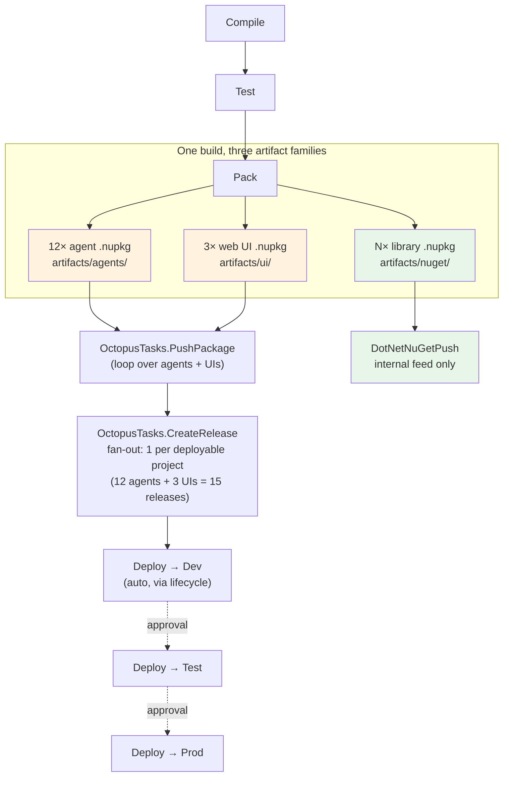
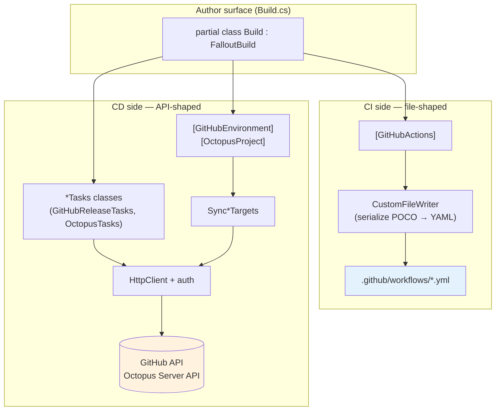

# ADR-0001 — CD primitives: attributes for config, tasks for state

- **Status:** Proposed
- **Date:** 2026-05-24
- **Deciders:** Fallout maintainers
- **Relates to:** RFC [#106](https://github.com/Fallout-build/Fallout/issues/106) (CD platform vision), RFC [#113](https://github.com/Fallout-build/Fallout/issues/113) (deployment agent), milestone [v13](https://github.com/Fallout-build/Fallout/milestone/8), epic [#139](https://github.com/Fallout-build/Fallout/issues/139) (package-manager distribution)

## Context

Fallout already has a well-established CI integration pattern: a class-level `[GitHubActions(...)]` attribute is reflected into a POCO at startup, the POCO is serialized to `.github/workflows/*.yml` by a hand-rolled writer, the file is committed. See `src/Fallout.Common/CI/GitHubActions/GitHubActionsAttribute.cs` for the canonical implementation, `src/Fallout.Build/CICD/GenerateBuildServerConfigurationsAttribute.cs` for the middleware that drives generation, and `build/Build.CI.GitHubActions.cs` for live usage.

The v13 milestone introduces **continuous delivery** — release tracking, environment promotion, approval gates, deployment-target execution. The natural question for contributors is: *do we keep using the attribute-driven file-generation pattern, or does CD need something different?*

Three concrete drivers force the question:

1. **GitHub Releases & Environments** (immediate need — once v13 lands).
2. **Octopus Deploy** (target: 2019 on-prem server — concrete consumer ask).
3. **The deployment agent of RFC #113** — needs to be told what to deploy where, by what.

These three share a property the CI side doesn't have: **their state lives in an external system's database**, not in a file you commit. You don't "generate a Release"; you POST one. You don't "generate an Environment"; you reconcile its config via the API. The existing attribute → writer pattern is wrong-shaped for that.

## Decision

CD primitives split into **two** patterns, picked by whether the primitive's state is *file-shaped* or *API-shaped*:

| Pattern | When | Mechanism |
|---|---|---|
| **Attribute → file writer** (existing) | Output is a config file committed to git | `[Attribute]` → POCO → `Write(CustomFileWriter)` → `.yml` / `.toml` / `.json` on disk |
| **Tasks → REST client** (new) | Output is state in an external system's database | `*Tasks` static class with methods that issue authenticated HTTP calls; called from C# targets |
| **Attribute + sync target** (hybrid, sparingly) | Configuration that is *stable* but lives in an external DB (e.g. Environments, Octopus Projects) | `[Attribute]` declares the config; a `Sync*` target reads the attributes via reflection and PUTs them through the API |

The hybrid is the bridge — declarative authoring, imperative reconciliation. Use it only where the *definition* is stable across runs (an Environment's reviewers don't change every release). Releases and Deployments, which are inherently per-version, stay pure tasks.

### Why not all-attribute?

You'd need a file writer that "generates Releases." But Releases live in GitHub/Octopus, not on disk — there's no file to write. Forcing the pattern means inventing fictional artifacts (`.github/releases/v1.2.3.json`?) that nothing consumes.

### Why not all-task?

Environments and Octopus Projects *are* configuration — required reviewers, lifecycle definitions, channel rules. Writing 30 lines of imperative API calls every time you want to add a reviewer is the YAML problem in disguise. The hybrid keeps declarative authoring where it earns its weight.

## Sketches

### 1. GitHub Releases — pure tasks

```csharp
// src/Fallout.Common/Tools/GitHub/Releases/GitHubReleaseTasks.cs

public static partial class GitHubReleaseTasks
{
    public static async Task<GitHubRelease> CreateGitHubRelease(
        Configure<CreateGitHubReleaseSettings> configurator)
    {
        var settings = configurator(new CreateGitHubReleaseSettings());

        var response = await GitHubHttpClient.Value
            .CreateRequest(HttpMethod.Post, $"repos/{settings.Repository}/releases")
            .WithBearerToken(settings.Token)
            .WithJsonContent(new
            {
                tag_name = settings.TagName,
                name = settings.Name,
                body = settings.Body,
                draft = settings.Draft,
                prerelease = settings.PreRelease,
                make_latest = settings.MakeLatest ? "true" : "false"
            })
            .GetResponseAsync();

        return await response.AsJsonAsync<GitHubRelease>();
    }

    public static async Task UploadReleaseAsset(
        long releaseId,
        AbsolutePath asset,
        Configure<UploadReleaseAssetSettings> configurator = null)
    {
        var settings = (configurator ?? (s => s))(new UploadReleaseAssetSettings());
        // POST to uploads.github.com/repos/{repo}/releases/{id}/assets?name={file}
        // ... binary upload, returns asset metadata
    }

    public static async Task<GitHubRelease> GetLatestRelease(string repository, string token) { /* ... */ }
    public static async Task DeleteGitHubRelease(long releaseId, string repository, string token) { /* ... */ }
}

public class CreateGitHubReleaseSettings : ToolSettings
{
    public string Repository { get; internal set; }
    public string Token { get; internal set; }
    public string TagName { get; internal set; }
    public string Name { get; internal set; }
    public string Body { get; internal set; }
    public bool Draft { get; internal set; }
    public bool PreRelease { get; internal set; }
    public bool MakeLatest { get; internal set; } = true;
}

public static class CreateGitHubReleaseSettingsExtensions
{
    public static T SetTagName<T>(this T settings, string tagName) where T : CreateGitHubReleaseSettings
        => settings.With(s => s.TagName = tagName);
    // ... idiomatic fluent setters matching the existing Tool wrapper convention
}
```

Used from a target — composes with everything else (`DependsOn`, `Requires`, `OnlyWhen*`):

```csharp
[Parameter, Secret] readonly string GitHubToken;

Target PublishGitHubRelease => _ => _
    .DependsOn(Pack)
    .OnlyWhenStatic(() => GitRepository.IsOnMainBranch())
    .Requires(() => GitHubToken)
    .Executes(async () =>
    {
        var release = await GitHubReleaseTasks.CreateGitHubRelease(s => s
            .SetRepository("Fallout-build/Fallout")
            .SetToken(GitHubToken)
            .SetTagName($"v{MajorMinorPatchVersion}")
            .SetName($"Fallout {MajorMinorPatchVersion}")
            .SetBody(ChangelogTasks.ExtractNotes(ChangelogFile, MajorMinorPatchVersion)));

        await PackagesDirectory.GlobFiles("*.nupkg").ForEachAsync(asset =>
            GitHubReleaseTasks.UploadReleaseAsset(release.Id, asset));
    });
```

### 2. GitHub Environments — hybrid (attribute + sync)

```csharp
// src/Fallout.Common/CD/GitHubEnvironments/GitHubEnvironmentAttribute.cs

[AttributeUsage(AttributeTargets.Class, AllowMultiple = true)]
public class GitHubEnvironmentAttribute : DeploymentConfigurationAttributeBase
{
    public GitHubEnvironmentAttribute(string name) => Name = name;
    public string Name { get; }
    public string[] RequiredReviewers { get; set; } = new string[0];
    public uint WaitTimerMinutes { get; set; }
    public string DeploymentBranchPolicy { get; set; }      // "main" / "protected" / "selected"
    public string[] AllowedBranchPatterns { get; set; } = new string[0];
    public string[] ImportSecrets { get; set; } = new string[0];   // creates env-scoped secrets

    public override Type ProviderType => typeof(GitHubEnvironmentProvider);
}
```

```csharp
// build/Build.CD.cs

[GitHubEnvironment("staging",
    WaitTimerMinutes = 0,
    DeploymentBranchPolicy = "selected",
    AllowedBranchPatterns = new[] { "main", "release/*" })]
[GitHubEnvironment("production",
    RequiredReviewers = new[] { "@chrisonsimtian/release-managers" },
    WaitTimerMinutes = 30,
    DeploymentBranchPolicy = "selected",
    AllowedBranchPatterns = new[] { "main" },
    ImportSecrets = new[] { "NuGetApiKey", "OctopusApiKey" })]
partial class Build { }
```

```csharp
Target SyncGitHubEnvironments => _ => _
    .Requires(() => GitHubToken)
    .Executes(async () =>
    {
        foreach (var env in this.GetType().GetCustomAttributes<GitHubEnvironmentAttribute>())
            await GitHubEnvironmentTasks.UpsertEnvironment(env, "Fallout-build/Fallout", GitHubToken);
    });
```

Same shape as `[GenerateBuildServerConfigurations]`, but the "generator" emits API calls instead of file writes. Run on demand; not part of the build hot path.

The CI side gains **one** new property to close the loop:

```csharp
[GitHubActions("deploy-production", GitHubActionsImage.UbuntuLatest,
    OnPushBranches = new[] { "main" },
    InvokedTargets = new[] { nameof(Deploy) },
    Environment = "production")]   // ← references the environment by name
```

Definition lives in API-land; reference lives in YAML. Clean split.

### 3. Octopus Deploy 2019 — same patterns, larger surface, shipped as a v12 plugin

Octopus is a richer domain (Projects, Releases, Channels, Lifecycles, Environments, Targets, Variables, Tenants), but the same two patterns cover it.

**Placement:** unlike `Fallout.Common.GitHub` (which is first-party, in-tree), Octopus integration is expected to ship as the **first sample plugin** on top of the v12 plugin SDK (milestone [#7](https://github.com/Fallout-build/Fallout/milestone/7)). The maintainer's own Octopus 2019 server has full API support, so the plugin doubles as a dogfooding vehicle for the SDK. This is a design-validation win: if a real consumer with a non-trivial provider can be built as a clean external plugin, the SDK has succeeded; if it forces awkward escape hatches, the SDK isn't ready. **The patterns below are framework-shape; the *namespace* and *package* are v12-plugin-shape.**

```csharp
// Pure tasks — per-release imperative
public static partial class OctopusTasks
{
    public static Task PushPackage(AbsolutePath package, OctopusEndpoint endpoint);
    public static Task<OctopusRelease> CreateRelease(Configure<CreateOctopusReleaseSettings> configurator);
    public static Task<OctopusDeployment> DeployRelease(Configure<DeployOctopusReleaseSettings> configurator);
    public static Task<OctopusDeployment> WaitForDeployment(string deploymentId, OctopusEndpoint endpoint, TimeSpan timeout);
    public static Task PromoteRelease(string releaseId, string toEnvironment, OctopusEndpoint endpoint);
}

// Hybrid — Project + Channel + Lifecycle are stable config, declared once
[OctopusProject("Agent.WebScraper", LifecycleId = "Lifecycles-Standard")]
[OctopusProject("Agent.Indexer",    LifecycleId = "Lifecycles-Standard")]
// ... 10 more
partial class Build { }

Target SyncOctopusProjects => _ => _
    .Requires(() => OctopusApiKey)
    .Executes(async () => { /* read attributes, PUT to /api/projects */ });
```

The mental shift vs GitHub: **Octopus owns the deployment process**. Fallout's job is "build, push to feed, create release, optionally trigger deployment, optionally wait." The actual *what runs on which machine* is Octopus's deployment process definition — also code-defined (under Octopus's own `Octopus.Cli` / config-as-code), but a separate concern.

## The user's scenario — one big build, many deployments

> *"I have a solution where I have one big build but then multiple deployments across multiple projects: a dozen agents, two to three web UIs, and a handful of NuGet packages."*

This is the **monorepo-with-coordinated-release** pattern. The deciding question is whether all artifacts share a version stream (simpler) or each evolves independently (more complex). Default: shared version stream — every artifact gets `MajorMinorPatchVersion` from `Nerdbank.GitVersioning`, every Octopus Release uses that same version.

### Mental model



Note the **green path** for libraries: those never enter Octopus, they go straight to a NuGet feed. Mixing them into Octopus would create 5+ throwaway projects whose "deployment" is meaningless. Keep the lanes separate from the start.

### Concrete Build.cs sketch

```csharp
[Octopus(Server = "https://octopus.internal", ApiKey = nameof(OctopusApiKey))]
partial class Build : FalloutBuild
{
    [Parameter, Secret] readonly string OctopusApiKey;
    [Parameter, Secret] readonly string InternalNuGetApiKey;

    static readonly DeployableProject[] Agents = new[]
    {
        new DeployableProject("Agent.WebScraper",  "src/Agents/Agent.WebScraper"),
        new DeployableProject("Agent.Indexer",     "src/Agents/Agent.Indexer"),
        new DeployableProject("Agent.Reporter",    "src/Agents/Agent.Reporter"),
        // ... 9 more
    };

    static readonly DeployableProject[] WebUIs = new[]
    {
        new DeployableProject("Customer.UI", "src/UI/Customer.UI"),
        new DeployableProject("Admin.UI",    "src/UI/Admin.UI"),
        new DeployableProject("Ops.UI",      "src/UI/Ops.UI"),
    };

    static readonly DeployableProject[] Libraries = new[]
    {
        new DeployableProject("Common.Contracts", "src/Common.Contracts"),
        new DeployableProject("Common.Telemetry", "src/Common.Telemetry"),
        // ...
    };

    IEnumerable<DeployableProject> Deployables => Agents.Concat(WebUIs);

    Target Pack => _ => _
        .DependsOn(Test)
        .Executes(() =>
        {
            Deployables.Concat(Libraries).ForEach(p =>
                DotNetTasks.DotNetPack(s => s
                    .SetProject(p.ProjectPath)
                    .SetVersion(MajorMinorPatchVersion)
                    .SetOutputDirectory(ArtifactsDir / p.Kind)));
        });

    Target PushToOctopus => _ => _
        .DependsOn(Pack)
        .OnlyWhenStatic(() => GitRepository.IsOnMainBranch())
        .Requires(() => OctopusApiKey)
        .Executes(async () =>
        {
            await Deployables.ForEachAsync(p =>
                OctopusTasks.PushPackage(
                    ArtifactsDir / p.Kind / $"{p.Name}.{MajorMinorPatchVersion}.nupkg",
                    OctopusEndpoint));
        });

    Target PushToNuGet => _ => _
        .DependsOn(Pack)
        .OnlyWhenStatic(() => GitRepository.IsOnMainBranch())
        .Requires(() => InternalNuGetApiKey)
        .Executes(async () =>
        {
            await Libraries.ForEachAsync(p =>
                DotNetTasks.DotNetNuGetPush(s => s
                    .SetTargetPath(ArtifactsDir / p.Kind / $"{p.Name}.{MajorMinorPatchVersion}.nupkg")
                    .SetSource(InternalNuGetFeed)
                    .SetApiKey(InternalNuGetApiKey)));
        });

    Target CreateOctopusReleases => _ => _
        .DependsOn(PushToOctopus)
        .Requires(() => OctopusApiKey)
        .Executes(async () =>
        {
            await Deployables.ForEachAsync(p =>
                OctopusTasks.CreateRelease(s => s
                    .SetEndpoint(OctopusEndpoint)
                    .SetProject(p.Name)
                    .SetVersion(MajorMinorPatchVersion)
                    .SetReleaseNotes(ChangelogTasks.ExtractNotes(ChangelogFile, MajorMinorPatchVersion))
                    .EnableIgnoreExisting()));
        });

    Target DeployToDev => _ => _
        .DependsOn(CreateOctopusReleases)
        .Executes(async () =>
        {
            await Deployables.ForEachAsync(p =>
                OctopusTasks.DeployRelease(s => s
                    .SetEndpoint(OctopusEndpoint)
                    .SetProject(p.Name)
                    .SetVersion(MajorMinorPatchVersion)
                    .SetEnvironment("Dev")));
        });
}

record DeployableProject(string Name, string ProjectPath)
{
    public string Kind => /* "agents" | "ui" | "library" — derived from path */;
}
```

The shape is deliberately mundane. C# expresses the inventory; LINQ does the fan-out; the framework does dependency ordering. **No new conceptual machinery — just the existing target + task primitives applied to a richer external API.**

## The two-stack architecture (the diagram you asked for)



Both stacks share the **upper half** — `Build.cs`, the `FalloutBuild` class, the middleware pipeline, reflection-based discovery. They diverge in the **lower half** — file emission for things you commit, REST calls for things that live in someone else's database.

## Consequences

### Positive

- **Two patterns is the right number.** "All attribute" forces fictional artifacts (release JSON files); "all task" loses declarative environment definitions. The split mirrors the real shape of the domain.
- **Test isolation.** REST clients sit behind interfaces (`IGitHubReleaseClient`, `IOctopusClient`); targets calling them are unit-testable with a mock. The CI side doesn't need this because it's already pure-function (POCO → string).
- **Provider symmetry.** Both `Fallout.Common.GitHub` and `Fallout.Common.Octopus` end up the same shape — Tasks class + (optionally) a hybrid attribute + a host class. New providers slot in without touching the build kernel.
- **Composes with v11 middleware.** `IOnTargetSucceeded`, `IOnBuildFinished` hooks can wrap deployment policy (post-Pack release listener, post-deploy notification) — exactly the role v12's plugin SDK extends.
- **Clear lane for the deployment agent.** RFC #113's `fallout-agent` becomes the *executor* invoked by the deployment-task layer, not a parallel concept. The agent doesn't need to understand Octopus or GitHub Releases — it just runs scripts.

### Negative

- **Two patterns to teach.** Contributors will sometimes pick the wrong one. The mitigation is naming: `*Tasks` always means runtime imperative, `[*Attribute]` always means declarative metadata. If a contributor reaches for an attribute and finds themselves writing imperative API logic, that's a signal they want a task.
- **Auth model proliferation.** Each provider brings its own auth idioms (GitHub token, Octopus API key, GitLab token, …). We need a single `[Parameter, Secret]` convention and a discipline of "secrets live in attributes' `ImportSecrets`, not in code."
- **State drift.** API-shaped state can diverge from what the build declared (someone edits an environment in the GitHub UI). The sync target is *reconcile-on-demand*, not continuous. Documenting "your `[GitHubEnvironment]` attribute is the source of truth, run `SyncGitHubEnvironments` after edits" is mandatory.
- **The hybrid attribute is the easiest to misuse.** Tempting to keep adding fields to it — `[GitHubEnvironment(Name, Reviewers, WaitTimer, BranchPolicy, Secrets, DeploymentURL, ProtectionRule, RuleSet, …)]`. Cap it at "stable configuration that rarely changes per release." Dynamic things go in tasks.

## Alternatives considered

### A. All-attribute, file-everywhere

Force CD primitives into the existing pattern by inventing files (`.fallout/releases/v1.2.3.json`, `.fallout/environments/production.yaml`) that a separate "applier" CLI reads and POSTs to GitHub/Octopus.

**Rejected** because the files have no consumers other than the applier — they're make-believe artifacts. Worse, they re-introduce the "config file as source of truth" problem the framework's code-first philosophy explicitly rejects. The author would refactor by editing JSON files, not C#.

### B. All-task, no declarative

Drop the hybrid; every provider is just a Tasks class. Environments are managed by writing imperative `UpsertEnvironment(...)` calls in a target.

**Rejected** because Environments and Octopus Projects *are* configuration. Twelve agent projects written as `await OctopusTasks.UpsertProject("Agent.WebScraper", lifecycle: "..."); await OctopusTasks.UpsertProject("Agent.Indexer", ...);` is a YAML problem in disguise. Lose the ability to inspect "what environments does this build define?" at a glance.

### C. Adopt an existing client library (Octokit, Octopus.Client)

Skip the hand-rolled HTTP wrappers; depend on the official client libraries.

**Deferred.** The hand-rolled `_httpClient.Value.CreateRequest(...)` pattern in `GitHubActions.Client.cs` is small (~30 lines per endpoint) and avoids pulling in a transitive dependency tree per provider. Octokit-specifically also has [historical churn](https://github.com/octokit/octokit.net/issues) that consumers don't want propagating. Revisit if the wrapper surface grows past ~20 endpoints per provider; below that, hand-rolling pays for itself.

## References

- RFC [#106](https://github.com/Fallout-build/Fallout/issues/106) — Continuous Delivery vision
- RFC [#113](https://github.com/Fallout-build/Fallout/issues/113) — CD deployment agent
- Existing CI pattern: `src/Fallout.Common/CI/GitHubActions/`, `src/Fallout.Build/CICD/GenerateBuildServerConfigurationsAttribute.cs`
- Existing task wrapper pattern: `src/Fallout.Common/Tools/GitHub/GitHubTasks.cs`
- Existing runtime API client: `src/Fallout.Common/CI/GitHubActions/GitHubActions.Client.cs`
- Architecture context: `docs/architecture.md`
