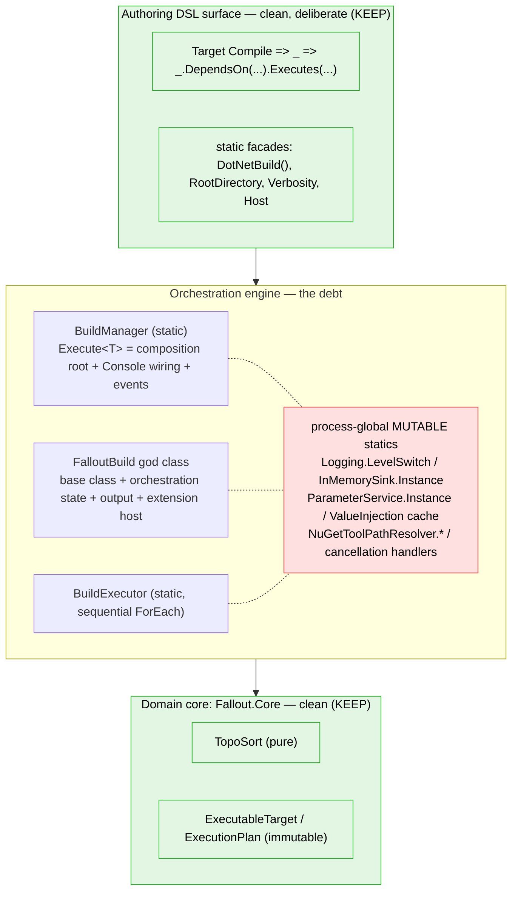
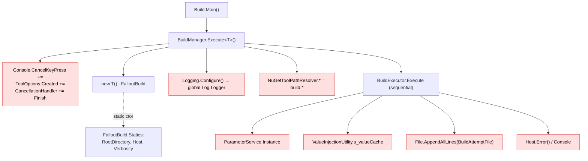
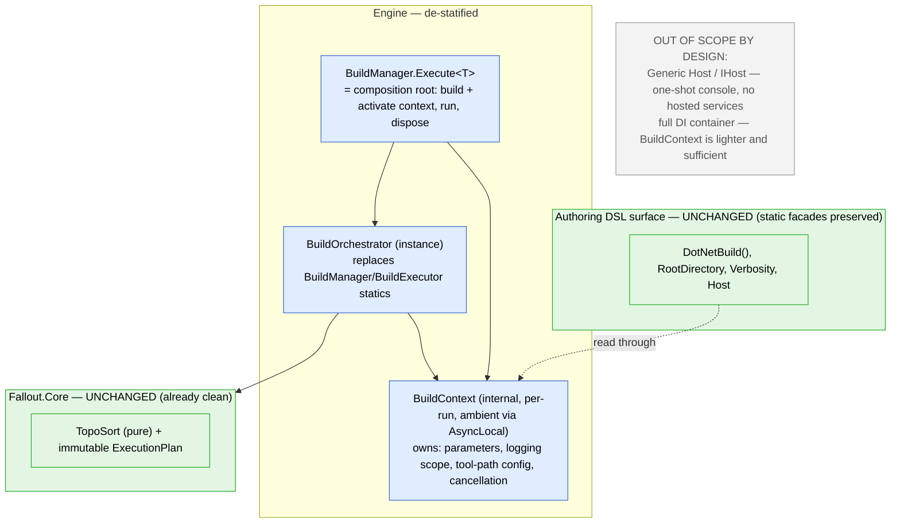

# Engine de-statification — architecture assessment

> Deeper dive into the build orchestrator's internals and the `[Foundation]` epic that reshapes them.
> The canonical discussion lives on the epic — [#315](https://github.com/Fallout-build/Fallout/issues/315) — and this doc mirrors it so the rationale is versioned alongside the code.
> For repo layout / project groupings, see [architecture.md](architecture.md).

## TL;DR

There are effectively **three codebases stacked here, at very different quality levels**:

1. **Domain core (`Fallout.Core`) — clean.** `TopoSort` is a pure function (no I/O, no input mutation, no ambient reads); `ExecutableTarget` / `ExecutionPlan` are effectively immutable. **Keep as-is.**
2. **Authoring DSL surface — clean *and deliberate*.** `Target X => _ => _.DependsOn(...).Executes(...)`, `RootDirectory / "out"`, `DotNetBuild(...)`. The static-ness here is an intentional ergonomics choice. **Must stay static — do not "fix" it.**
3. **Orchestration engine — the debt.** A god class plus process-global mutable statics. **This is the only layer the epic touches.**

The fix is an **internal `BuildContext`** (ambient, per-run) with the static surface preserved as facades over it — **not** `Microsoft.Extensions.Hosting` (`IHost`), and **not** a full `Microsoft.Extensions.DependencyInjection` container.

## What is actually static, and why

A common misconception is that "the DSL has to be static to be fluent." It doesn't. In `build/Build.cs` the **bulk of the authoring model is already instance-based**:

- **Targets** are instance properties: `Target Clean => _ => _.Before<IRestore>().Executes(...)` (`Build.cs:83`).
- **Inputs** are instance fields injected by attribute middleware: `[Solution] readonly Solution Solution` (`:41`), `[Parameter] readonly bool Major` (`:72`), `[Secret] readonly string NuGetApiKey` (`:128`).
- **Component composition** is `this`-based: `From<T>() => (T)(object)this` (`:296`).

The statics are only two narrow ergonomic categories (plus the unavoidable `Main`/`Execute<T>` entrypoint):

1. **Global helper functions** via `using static` — `DotNetBuild(...)`, `DotNet(...)`, `SuppressErrors(...)` (`Build.cs:17-18`). Terseness: bare function calls instead of `_tools.DotNet.Build(...)`.
2. **Ambient context properties** — `RootDirectory` (`:44`), `BuildProjectFile` (`:178`), `Host` (`:123`), `Partition` (`:104`). Static so they read unqualified from anywhere, including non-build helper classes that hold no build instance.

So the static surface is **sugar for two ergonomic cases**, not a runtime requirement. The engine *inherited* that static-ness as per-run state — and that inheritance, not the sugar, is the bug.

## Current architecture (as-is)

How a run touches global state, and where it leaks across invocations:

### Problems (all in the engine)

- **God class** — `FalloutBuild` is ~456 LOC across 5 partials with 4 responsibilities: inheritable base class (`FalloutBuild.cs`), process-global state + static ctor (`FalloutBuild.Statics.cs:16-30`), output formatting (`FalloutBuild.Output.cs`), extension host (`FalloutBuild.Events.cs`). The partials hide the size, not the coupling.
- **Static state leaks across runs** — `BuildManager.cs:20,41,69` (handlers accumulate), `Logging.cs:20,214` (`LevelSwitch` + `InMemorySink.Instance` carry log events over), `ValueInjectionUtility.cs:13` (`s_valueCache` persists), `NuGetToolPathResolver.cs:14-17` (set per-run at `BuildManager.cs:53-56`, never reset).
- **Test/prod path divergence** — production reads the static `ParameterService.Instance` (`ParameterService.Statics.cs:11-13`), but `ParameterServiceTest.cs:14-22` constructs a *fresh* `ParameterService(funcs)`. Tests exercise a different object than production.
- **No DIP seams** — `BuildManager.cs:39-41` pokes `Console` directly; `BuildExecutor.cs:81` writes the filesystem directly; output goes through static `Host.Error()`.

### What's already good (and stays)

Planning vs execution is cleanly split (`ExecutionPlanner` vs `BuildExecutor`); extension discovery is deterministic (`FalloutBuild.Events.cs:21-25`, source-order + stable priority sort) and visible in one place (`FalloutBuild.cs:45-62`); parameter injection is type-safe/lazy via expressions.

## Target architecture (to-be) — clean *where it makes sense*

### Mapping to the FT tickets

| Change | FT ticket |
|---|---|
| Fix cross-invocation leaks first (non-breaking, size S) | [#306](https://github.com/Fallout-build/Fallout/issues/306) FT-1 |
| Internal `BuildContext` + ambient activation | [#307](https://github.com/Fallout-build/Fallout/issues/307) FT-2 |
| Static build properties → facades over `BuildContext.Current` | [#308](https://github.com/Fallout-build/Fallout/issues/308) FT-3 |
| `ParameterService` instance-based + re-parseable | [#309](https://github.com/Fallout-build/Fallout/issues/309) FT-4 |
| Context-scope tool-path resolvers + process defaults | [#310](https://github.com/Fallout-build/Fallout/issues/310) FT-5 |
| Per-run, thread-safe logging scope | [#311](https://github.com/Fallout-build/Fallout/issues/311) FT-6 |
| Formalize the extension pipeline (deterministic phases) | [#312](https://github.com/Fallout-build/Fallout/issues/312) FT-7 |
| Reentrancy/isolation test harness | [#314](https://github.com/Fallout-build/Fallout/issues/314) FT-9 |

The **god-class split** (base class / orchestration state → `BuildOrchestrator` / output formatter) rides along with FT-2/FT-3 rather than as a separate breaking step.

## Why not `IHost`, why not a full DI container

- **Generic Host (`HostApplicationBuilder` / `IHost`) is the wrong shape.** It exists for long-running processes — `IHostedService`/`BackgroundService`, host lifetime, graceful shutdown. A Fallout build is a one-shot synchronous pass returning an `int` exit code (`BuildManager.cs:74`) with cancellation already hand-wired (`BuildManager.cs:20-26,41`). `IHost` adds ceremony for zero payoff.
- **A full DI container is heavier than needed.** This is why [#89](https://github.com/Fallout-build/Fallout/issues/89) (introduce an MS.DI container) was superseded: the ambient `BuildContext` gives reentrancy + testability + a single composition root without forcing constructor-injection through a surface that is, by design, static. DI is available (net10.0 everywhere, `global.json:3`) and a *small* service set may be registered inside `Execute<T>()`, but the container is not the architecture — the context is.
- **The static surface cannot become instance-injected without breaking consumers.** `DotNetBuild(...)` and `RootDirectory` have no `this` to inject into. The facades reach an ambient accessor — the same pattern already used by `ParameterService.Instance` and `Host.Instance`. We **relocate** ambient state behind a context; we don't eliminate it.

## Honest caveat

Because the real "injection" today is reflection-based attribute middleware (`FalloutBuild.cs:45-62`) + ambient singletons, this is **plumbing modernization, not an IoC inversion**. The wins are concrete — safe reentrancy, real unit-testability of `ParameterService`/resolvers, one composition root, and it unblocks opt-in parallel execution ([#313](https://github.com/Fallout-build/Fallout/issues/313)) — but incremental. The core domain and the authoring DSL are already where they should be; this epic is about the engine in between.
